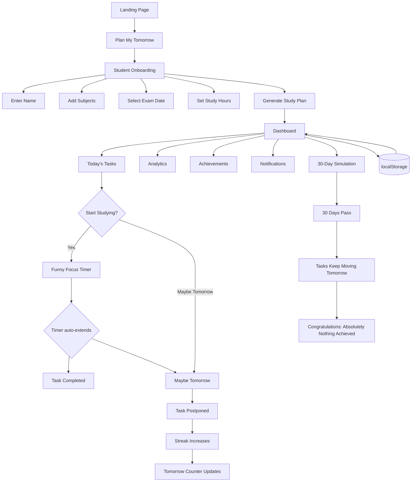

# Nale Thottu 🎯


## Basic Details
### Team Name: DOSA


### Team Members
- Team Lead: Don Aju - Vimal Jyothi Engineering College
- Member 2: Athul Sathian K - Vimal Jyothi Engineering College

### Project Description
Nale Thottu Padikkam is a polished but deliberately useless study-planning app for chronic procrastinators. It creates study plans, tracks tasks, and then enthusiastically helps users postpone everything until tomorrow.

### The Problem (that doesn't exist)
Students are under too much pressure to study today. Existing productivity apps keep reminding them about deadlines instead of respecting their belief that tomorrow will be a much better day.

### The Solution (that nobody asked for)
Our app creates a serious-looking study schedule, rewards procrastination streaks, generates excuses, tracks postponed tasks, and even extends the focus timer before users can finish. It makes achieving absolutely nothing feel premium.

## Technical Details
### Technologies/Components Used
For Software:

- Languages: TypeScript, CSS
- Frameworks: Next.js, React
- Libraries: Lucide React
- Tools: npm, localStorage, Vercel

For Hardware:

- No hardware required.

### Implementation
For Software:
# Installation
```powershell
npm.cmd install

# Run
npm.cmd run dev -- -p 3010

### Project Documentation
For Software:

# Screenshots (Add at least 3)
[](https://drive.google.com/file/d/1Dxg2kcD_y-y-BoUX0xC94808YbG5HIiY/view?usp=drive_link)
Project Dashboard

# Diagrams



## Team Contributions
- Don Aju
- Athul Sathian K

---
Made with ❤️ at TinkerHub Useless Projects 


